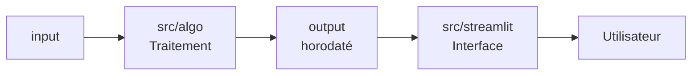
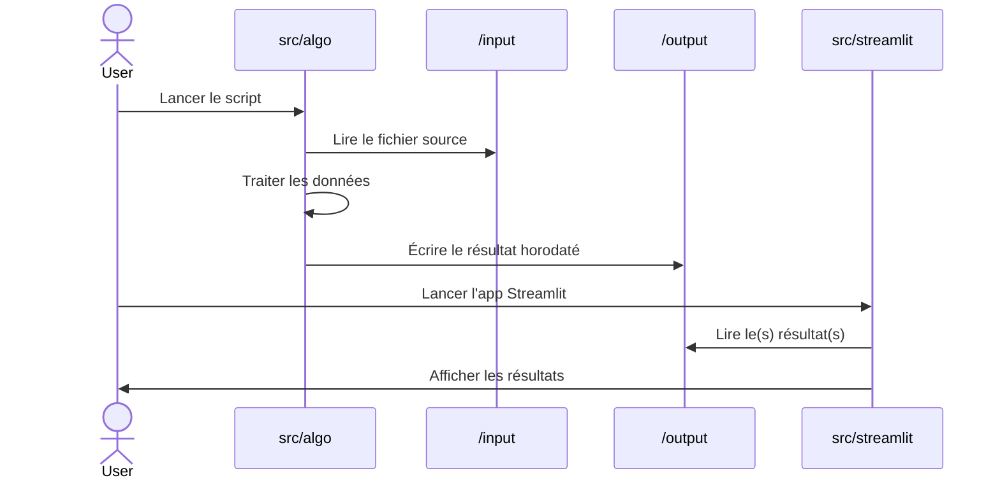

# Architecture

## Flux de données

```mermaid
flowchart LR
    A["input"] --> B["src/algo<br/>Traitement"]
    B --> C["output<br/>horodaté"]
    C --> D["src/streamlit<br/>Interface"]
    D --> E["Utilisateur"]
```

## Workflow

```mermaid
sequenceDiagram
    actor User
    participant Algo as src/algo
    participant Input as /input
    participant Output as /output
    participant UI as src/streamlit

    User->>Algo: Lancer le script
    Algo->>Input: Lire le fichier source
    Algo->>Algo: Traiter les données
    Algo->>Output: Écrire le résultat horodaté

    User->>UI: Lancer l'app Streamlit
    UI->>Output: Lire le(s) résultat(s)
    UI->>User: Afficher les résultats
```