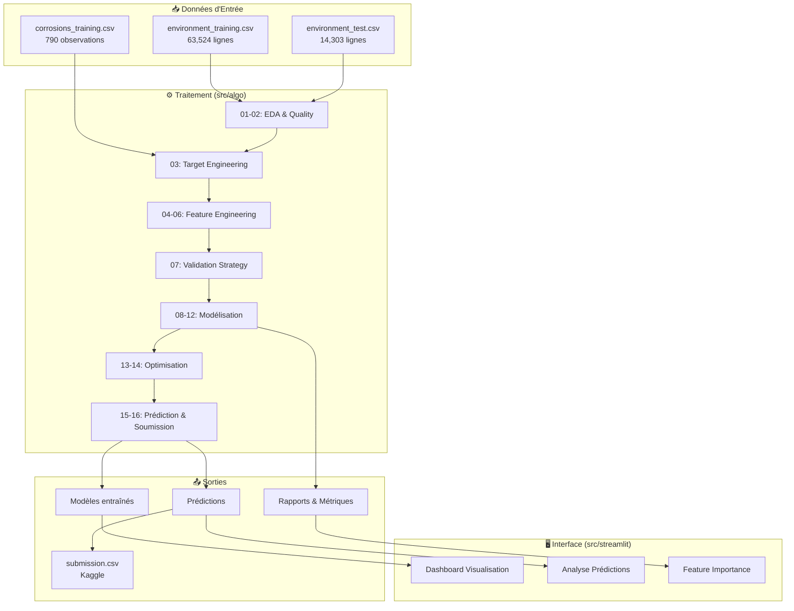
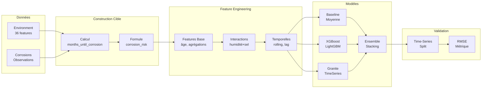
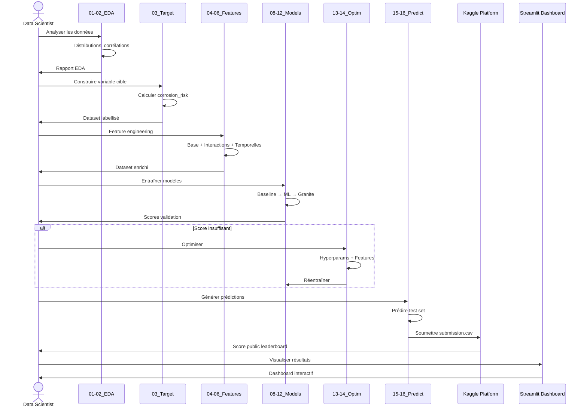
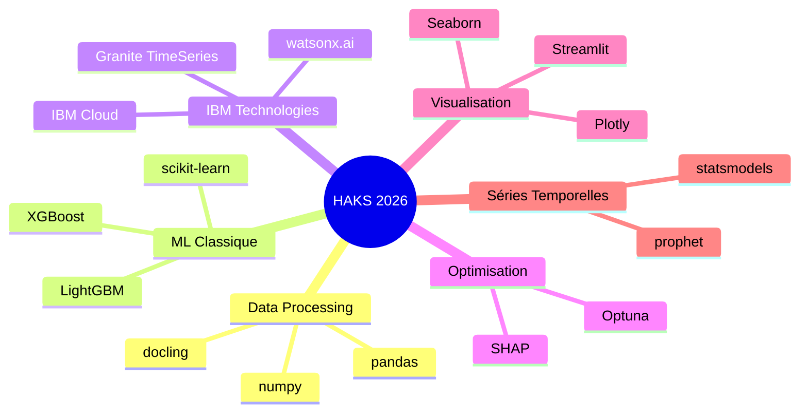
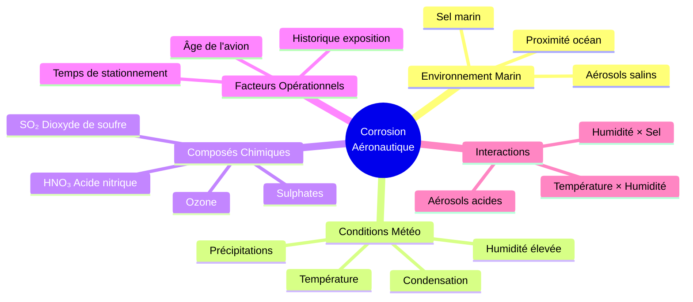
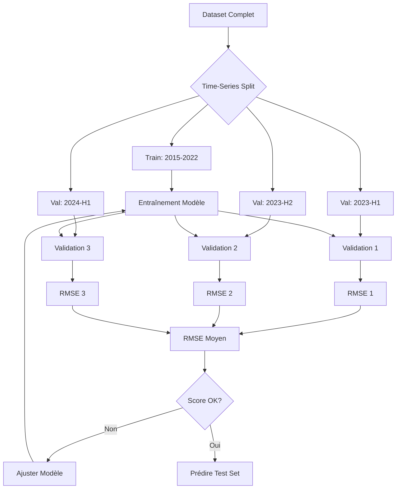

# Architecture - Hackathon HAKS 2026

## Vue d'Ensemble du Projet

Ce projet vise à prédire le risque de corrosion des avions en fonction de données environnementales mensuelles, dans le cadre du hackathon Kaggle "HAKS Airbus x IBM x AWS 2026".

## Flux de Données Principal



## Pipeline de Modélisation



## Workflow Détaillé



## Architecture Technique

### Structure des Scripts

```
src/algo/
├── 01_eda.py                          # Exploration des données
├── 02_data_quality.py                 # Analyse qualité
├── 03_target_engineering.py           # Construction cible
├── 04_feature_engineering_base.py     # Features de base
├── 05_feature_engineering_interactions.py  # Interactions
├── 06_feature_engineering_temporal.py # Features temporelles
├── 07_validation_strategy.py          # Stratégie validation
├── 08_baseline.py                     # Modèle baseline
├── 09_ml_models.py                    # XGBoost, LightGBM, RF
├── 10_granite_timeseries.py           # Modèle Granite
├── 11_survival_model.py               # Modèle de survie (optionnel)
├── 12_ensemble.py                     # Ensemble de modèles
├── 13_hyperparameter_tuning.py        # Optimisation hyperparams
├── 14_feature_selection.py            # Sélection features
├── 15_generate_predictions.py         # Prédictions test
└── 16_create_submission.py            # Fichier soumission
```

### Technologies Utilisées



## Facteurs Clés de Corrosion



## Stratégie de Validation



## Déploiement et Utilisation

### Exécution des Scripts

```bash
# 1. Exploration des données
uv run src/algo/01_eda.py

# 2. Construction de la cible
uv run src/algo/03_target_engineering.py

# 3. Feature engineering
uv run src/algo/04_feature_engineering_base.py

# 4. Entraînement modèles
uv run src/algo/09_ml_models.py

# 5. Génération prédictions
uv run src/algo/15_generate_predictions.py

# 6. Création soumission
uv run src/algo/16_create_submission.py
```

### Interface Streamlit

```bash
# Lancer le dashboard
uv run streamlit run src/streamlit/dashboard.py
```

## Métriques de Performance

| Métrique | Objectif | Description |
|----------|----------|-------------|
| **RMSE** | < 0.15 | Erreur quadratique moyenne sur corrosion_risk |
| **MAE** | < 0.10 | Erreur absolue moyenne |
| **R²** | > 0.70 | Coefficient de détermination |
| **Kaggle Score** | Top 20% | Position sur le leaderboard public |

## Risques et Mitigations

| Risque | Impact | Mitigation |
|--------|--------|------------|
| Leakage temporel | Élevé | Time-series split strict |
| Overfitting | Élevé | Validation croisée, régularisation |
| Features manquantes | Moyen | Imputation intelligente |
| Déséquilibre cible | Moyen | Pondération, SMOTE |
| Complexité modèle | Faible | Commencer simple, itérer |