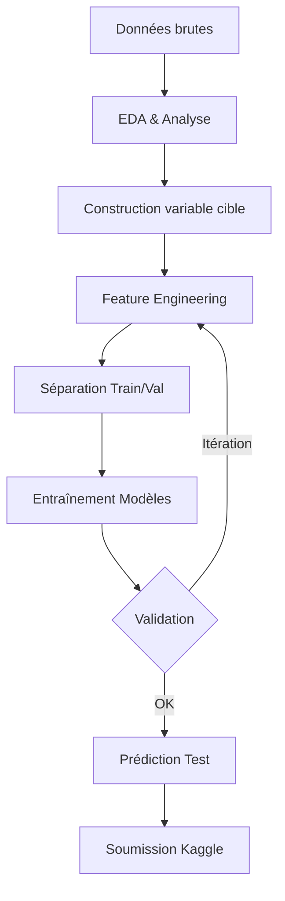

# Analyse du Hackathon HAKS Airbus x IBM x AWS 2026

## 🎯 Objectif du Hackathon

**Prédire le risque de corrosion des avions** en fonction de données environnementales et temporelles.

### Type de problème
- **Régression** : Prédire un score de risque de corrosion (`corrosion_risk`) entre 0 et 1
- **Séries temporelles** : Données mensuelles d'exposition environnementale

## 📊 Structure des Données

### 1. `corrosions_training.csv` (790 observations)
Données d'observations de corrosion réelles :
- `observation_date` : Date d'observation de la corrosion
- `aircraft_delivery_year` : Année de livraison de l'avion
- `aircraft_delivery_month` : Mois de livraison de l'avion
- `aircraft_id` : Identifiant unique de l'avion

**Note importante** : Ce fichier ne contient PAS de mesure quantitative de corrosion, seulement la date d'observation. La variable cible doit être construite.

### 2. `environment_training.csv` (63,524 lignes) et `environment_test.csv` (14,303 lignes)
Données environnementales mensuelles par avion (36 features) :

#### Identifiants temporels
- `aircraft_id` : Identifiant de l'avion
- `year_month` : Période (format YYYY-MM)
- `month_start_date` : Date de début du mois

#### Données opérationnelles
- `total_parking_minutes` : Temps de stationnement total

#### Données météorologiques (METAR)
- `metar_temperature_c` : Température (°C)
- `metar_relative_humidity` : Humidité relative (%)
- `metar_dew_point_c` : Point de rosée (°C)
- `metar_wind_speed_kn` : Vitesse du vent (nœuds)
- `metar_visibility_mi` : Visibilité (miles)
- `metar_hour_precipitation` : Précipitations horaires

#### Aérosols (facteurs de corrosion majeurs)
- `sea_salt_aerosol_*` : Aérosols de sel marin (3 tailles : 0.03-0.5, 0.5-5, 5-20 μm)
- `dust_aerosol_*` : Aérosols de poussière (3 tailles)
- `hydrophilic/hydrophobic_organic_matter_aerosol_mixing_ratio`
- `hydrophilic/hydrophobic_black_carbon_aerosol_mixing_ratio`
- `sulphate_aerosol_mixing_ratio`

#### Composés chimiques atmosphériques
- `ethane`, `c3h8`, `isoprene` : Hydrocarbures
- `carbon_monoxide_mass_mixing_ratio` : CO
- `ozone_mass_mixing_ratio` : O₃
- `h2o2` : Peroxyde d'hydrogène
- `formaldehyde` : Formaldéhyde
- `hno3` : Acide nitrique
- `nitrogen_monoxide/dioxide_mass_mixing_ratio` : NOₓ
- `oh` : Radical hydroxyle
- `organic_nitrates` : Nitrates organiques
- `sulphur_dioxide_mass_mixing_ratio` : SO₂

#### Autres paramètres
- `specific_humidity` : Humidité spécifique
- `temperature` : Température atmosphérique

### 3. `sample_submission-2.csv` (14,303 lignes)
Format de soumission attendu :
- `id` : Identifiant unique (format: `aircraft_id_year_month`)
- `aircraft_id` : Identifiant de l'avion
- `year_month` : Période à prédire
- `corrosion_risk` : Score de risque prédit (0-1)

## 🔍 Insights Clés

### Problématique de Construction de la Variable Cible
Le fichier `corrosions_training.csv` ne contient **pas de mesure quantitative** de corrosion, seulement :
- La date d'observation de corrosion
- L'âge de l'avion (année/mois de livraison)

**Stratégies possibles** :
1. **Approche binaire** : Marquer les mois précédant l'observation comme "à risque"
2. **Approche temporelle** : Calculer le "temps avant corrosion" pour chaque mois
3. **Approche probabiliste** : Modéliser la probabilité de corrosion dans les N prochains mois

### Facteurs de Corrosion Aéronautique

#### Facteurs critiques identifiés
1. **Sel marin** (`sea_salt_aerosol_*`) : Corrosion galvanique
2. **Humidité** (`metar_relative_humidity`, `specific_humidity`) : Accélérateur
3. **Température** : Influence la vitesse de réaction
4. **Composés soufrés** (`sulphate_aerosol`, `sulphur_dioxide`) : Corrosion acide
5. **Temps de stationnement** : Exposition prolongée

#### Interactions importantes
- Humidité + Sel → Corrosion électrochimique accélérée
- Température élevée + Humidité → Réactions plus rapides
- Aérosols acides (SO₂, HNO₃) + Humidité → Corrosion chimique

### Caractéristiques Temporelles
- **Données mensuelles** : Agrégation des conditions environnementales
- **Historique variable** : Certains avions ont plus d'historique que d'autres
- **Prédiction future** : Le test set contient des périodes futures

## 🎯 Approches Recommandées

### 1. Feature Engineering
- Créer des features d'interaction (humidité × sel, température × humidité)
- Calculer des moyennes mobiles (3, 6, 12 mois)
- Créer des features d'âge de l'avion
- Agréger les aérosols par catégorie (total sel, total poussière)
- Calculer des indices de corrosivité composite

### 2. Modèles Candidats

#### Modèles Classiques
- **XGBoost / LightGBM** : Excellents pour les features tabulaires
- **Random Forest** : Robuste, capture les interactions non-linéaires
- **Gradient Boosting** : Performance élevée sur données structurées

#### Modèles Séries Temporelles
- **Granite TimeSeries** (IBM) : Modèle foundation pour séries temporelles
- **LSTM / GRU** : Capture les dépendances temporelles
- **Transformer** : Attention sur l'historique temporel

#### Approche Hybride
- Modèle de survie (Cox, Random Survival Forest) pour modéliser le "temps avant corrosion"
- Ensemble de modèles (stacking)

### 3. Validation Strategy
- **Time-series split** : Respecter l'ordre temporel
- **Group K-Fold** : Grouper par `aircraft_id` pour éviter le data leakage
- **Métrique** : Probablement RMSE ou MAE sur `corrosion_risk`

## 🛠️ Technologies IBM Disponibles

### watsonx.ai
- Accès aux modèles Granite
- Infrastructure GPU pour entraînement
- Déploiement de modèles

### Granite TimeSeries
- Modèles pré-entraînés pour prévision temporelle
- Fine-tuning possible sur nos données
- [Cookbook disponible](https://github.com/ibm-granite-community/granite-timeseries-workshop)

### Docling
- Extraction de documentation technique (si PDFs disponibles)
- Analyse de rapports de maintenance

## 📈 Pipeline Proposé

## 🚀 Prochaines Étapes

1. **Exploration approfondie** : Analyser les distributions, corrélations, valeurs manquantes
2. **Construction de la cible** : Définir la stratégie de labellisation
3. **Baseline** : Modèle simple (moyenne, régression linéaire)
4. **Feature Engineering** : Créer les features pertinentes
5. **Modélisation** : Tester différents modèles
6. **Optimisation** : Hyperparameter tuning
7. **Ensemble** : Combiner les meilleurs modèles