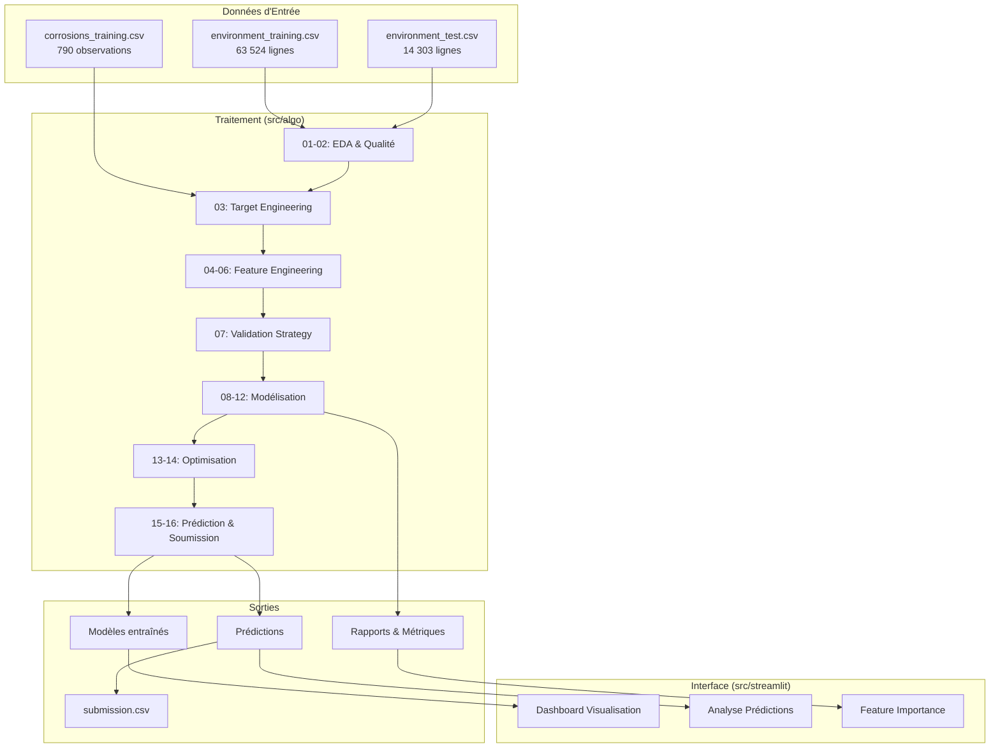
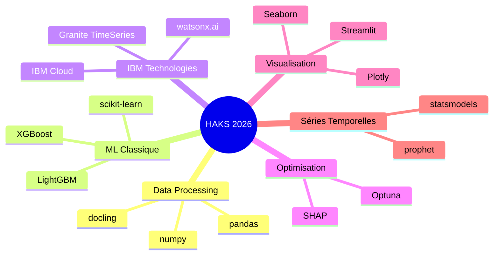
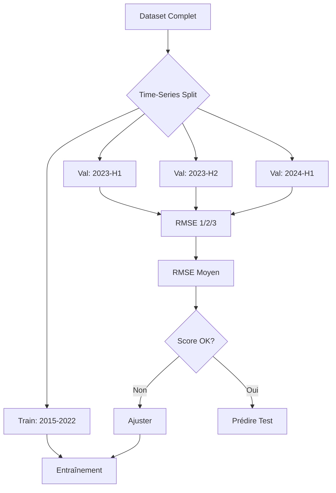

# Implémentation - Hackathon HAKS 2026

## Architecture Globale



## Structure des Scripts

```
src/algo/
├── 01_eda.py                               # Exploration des données
├── 02_data_quality.py                      # Analyse qualité, outliers, gaps
├── 03_target_engineering.py                # Construction de corrosion_risk
├── 04_feature_engineering_base.py          # Âge avion, agrégations aérosols, indices
├── 05_feature_engineering_interactions.py  # humidity×salt, temp×humidity, cumul
├── 06_feature_engineering_temporal.py      # Rolling, lag, delta features
├── 07_validation_strategy.py              # Time-series split, group k-fold
├── 08_baseline.py                         # Moyenne globale, par avion, régression linéaire
├── 09_ml_models.py                        # XGBoost, LightGBM, Random Forest
├── 10_granite_timeseries.py               # Modèle Granite IBM
├── 11_survival_model.py                   # Modèle de survie Cox (optionnel)
├── 12_ensemble.py                         # Stacking / blending
├── 13_hyperparameter_tuning.py            # Optuna
├── 14_feature_selection.py               # Importance, RFE, corrélations
├── 15_generate_predictions.py            # Prédictions test set
└── 16_create_submission.py               # Fichier soumission Kaggle
```

## Technologies



## Phase 1 : Exploration et Qualité des Données

**Scripts** : `01_eda.py`, `02_data_quality.py`

```python
# EDA : distributions, corrélations, patterns temporels, stats par avion
# Qualité : valeurs manquantes, outliers (IQR / Z-score), gaps temporels, duplicatas
# Traitement : médiane pour imputation, forward-fill pour séries, cap 99e percentile
```

**Output** : `output/YYYYMMDD_HHMMSS_eda_report.txt`

## Phase 2 : Construction de la Variable Cible

**Script** : `03_target_engineering.py`

```python
# Pour chaque ligne de environment_training.csv, joindre avec corrosions_training.csv
corrosion_risk = 1 / (months_until_corrosion + 1)
# Avions sans observation → risk = 0.0
```

## Phase 3 : Feature Engineering

**Scripts** : `04_feature_engineering_base.py`, `05_feature_engineering_interactions.py`, `06_feature_engineering_temporal.py`

```python
# Base
aircraft_age_months = (year_month - delivery_date).months
total_sea_salt = sum(sea_salt_aerosol_*)
month_sin = sin(2 * pi * month / 12)

# Interactions
humidity_salt = metar_relative_humidity * total_sea_salt
condensation_risk = metar_relative_humidity / (metar_temperature_c + 1)
cumulative_salt_exposure = cumsum(total_sea_salt)  # par aircraft_id

# Temporelles
for window in [3, 6, 12]:
    rolling_mean_humidity = rolling(metar_relative_humidity, window).mean()
for lag in [1, 3, 6]:
    lag_humidity = shift(metar_relative_humidity, lag)
delta_humidity = metar_relative_humidity - lag_1_humidity
```

## Phase 4 : Modélisation

### Stratégie de Validation

**Script** : `07_validation_strategy.py`



### Baseline

**Script** : `08_baseline.py` — moyenne globale, moyenne par avion, régression linéaire sur les 5 features les plus corrélées.

### Modèles ML

**Script** : `09_ml_models.py`

```python
import xgboost as xgb
model_xgb = xgb.XGBRegressor(
    n_estimators=1000, learning_rate=0.01, max_depth=6,
    subsample=0.8, colsample_bytree=0.8, objective='reg:squarederror'
)

import lightgbm as lgb
model_lgb = lgb.LGBMRegressor(
    n_estimators=1000, learning_rate=0.01, num_leaves=31,
    feature_fraction=0.8, bagging_fraction=0.8, objective='regression'
)

from sklearn.ensemble import RandomForestRegressor
model_rf = RandomForestRegressor(n_estimators=500, max_depth=15, n_jobs=-1)
```

### Granite TimeSeries

**Script** : `10_granite_timeseries.py`

```python
from transformers import AutoModelForSequenceClassification
model = AutoModelForSequenceClassification.from_pretrained(
    "ibm-granite/granite-timeseries-ttm-v1"
)
# Fine-tuning sur l'historique par aircraft_id
```

### Ensemble

**Script** : `12_ensemble.py`

```python
meta_features = np.column_stack([model_xgb.predict(X_val),
                                  model_lgb.predict(X_val),
                                  model_rf.predict(X_val)])
from sklearn.linear_model import Ridge
meta_model = Ridge(alpha=1.0)
meta_model.fit(meta_features, y_val)
```

## Phase 5 : Optimisation

**Scripts** : `13_hyperparameter_tuning.py`, `14_feature_selection.py`

```python
import optuna

def objective(trial):
    params = {
        'n_estimators': trial.suggest_int('n_estimators', 100, 2000),
        'learning_rate': trial.suggest_float('learning_rate', 0.001, 0.1, log=True),
        'max_depth': trial.suggest_int('max_depth', 3, 10),
    }
    model = xgb.XGBRegressor(**params)
    model.fit(X_train, y_train)
    return mean_squared_error(y_val, model.predict(X_val), squared=False)

study = optuna.create_study(direction='minimize')
study.optimize(objective, n_trials=100)

# Feature selection
from sklearn.feature_selection import RFE
selector = RFE(model, n_features_to_select=50)
selector.fit(X_train, y_train)
```

## Phase 6 : Prédiction et Soumission

**Scripts** : `15_generate_predictions.py`, `16_create_submission.py`

```python
predictions = np.clip(best_model.predict(X_test), 0, 1)

submission = pd.DataFrame({
    'id': test_ids,
    'aircraft_id': test_aircraft_ids,
    'year_month': test_year_months,
    'corrosion_risk': predictions
})
save_output(submission, 'submission.csv')
```

## Phase 7 : Dashboard Streamlit

**Script** : `src/streamlit/dashboard.py`

```python
import streamlit as st
import plotly.express as px

aircraft_id = st.selectbox("Sélectionner un avion", aircraft_ids)
fig = px.line(predictions[predictions.aircraft_id == aircraft_id],
              x='year_month', y='corrosion_risk')
st.plotly_chart(fig)
```

## Dépendances

```bash
uv add xgboost lightgbm optuna        # ML classique
uv add statsmodels prophet             # Séries temporelles
uv add transformers torch              # Granite TimeSeries
uv add plotly seaborn matplotlib       # Visualisation
uv add lifelines                       # Survie (optionnel)
```

## Commandes d'Exécution

```bash
uv run src/algo/01_eda.py
uv run src/algo/03_target_engineering.py
uv run src/algo/04_feature_engineering_base.py
uv run src/algo/09_ml_models.py
uv run src/algo/15_generate_predictions.py
uv run src/algo/16_create_submission.py

# Dashboard
uv run streamlit run src/streamlit/dashboard.py
```

## Métriques de Performance

| Métrique | Objectif |
|----------|----------|
| RMSE | < 0.15 |
| MAE | < 0.10 |
| R² | > 0.70 |
| Kaggle Score | Top 20% |

## Risques et Mitigations

| Risque | Mitigation |
|--------|------------|
| Leakage temporel | Time-series split strict, jamais de données futures |
| Overfitting | Validation croisée, régularisation, SHAP pour interprétabilité |
| Features manquantes | Imputation médiane, forward-fill |
| Déséquilibre de la cible | Pondération, SMOTE si nécessaire |
