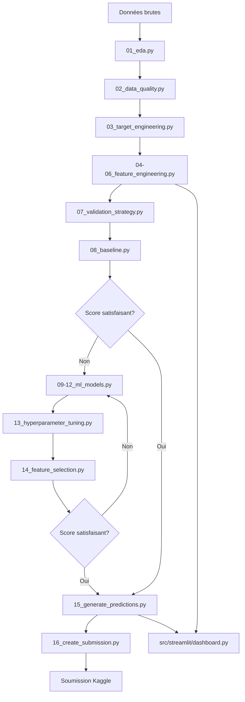

# Plan d'Implémentation - Hackathon HAKS 2026

## 📋 Vue d'Ensemble

Ce document détaille le plan d'implémentation pour résoudre le challenge de prédiction de corrosion des avions.

## 🎯 Objectif Final

Créer un modèle ML qui prédit le **risque de corrosion** (`corrosion_risk` entre 0 et 1) pour chaque avion et chaque mois du test set, en utilisant :
- Historique environnemental mensuel (36 features)
- Données d'observations de corrosion passées
- Technologies IBM (watsonx.ai, Granite TimeSeries)

## 📊 Phase 1 : Exploration et Compréhension des Données

### 1.1 Analyse Exploratoire (EDA)

**Script** : `src/algo/01_eda.py`

**Objectifs** :
- Comprendre les distributions de chaque feature
- Identifier les corrélations entre variables
- Détecter les patterns temporels
- Analyser la répartition des avions et périodes

**Analyses clés** :
```python
# Distribution des observations de corrosion par année
# Histogrammes des features environnementales
# Matrice de corrélation (focus sur facteurs de corrosion)
# Analyse temporelle : tendances saisonnières
# Statistiques par avion : min/max/mean des expositions
```

**Outputs** :
- `output/YYYYMMDD_HHMMSS_eda_report.txt` : Statistiques descriptives
- Visualisations sauvegardées pour Streamlit

### 1.2 Analyse de Qualité des Données

**Script** : `src/algo/02_data_quality.py`

**Vérifications** :
- Valeurs manquantes par colonne
- Outliers (méthode IQR et Z-score)
- Cohérence temporelle (gaps dans les séries)
- Duplicatas potentiels

**Stratégies de traitement** :
- Imputation : médiane pour features numériques, forward-fill pour séries temporelles
- Outliers : cap à 99e percentile ou investigation manuelle
- Gaps temporels : interpolation linéaire ou marquage

## 🎯 Phase 2 : Construction de la Variable Cible

### 2.1 Problématique

Le fichier `corrosions_training.csv` contient uniquement :
- Date d'observation de corrosion
- Identifiant avion
- Date de livraison avion

**Il n'y a pas de mesure quantitative de corrosion !**

### 2.2 Stratégies de Labellisation

**Script** : `src/algo/03_target_engineering.py`

#### Option A : Approche "Temps avant Corrosion" (Recommandée)

Pour chaque ligne de `environment_training.csv` :
```python
corrosion_risk = 1 / (months_until_corrosion + 1)
```

**Logique** :
- Si corrosion observée dans 1 mois → risk = 1.0
- Si corrosion observée dans 6 mois → risk = 0.14
- Si corrosion observée dans 24 mois → risk = 0.04
- Si pas de corrosion observée → risk = 0.0 (ou valeur minimale)

**Avantages** :
- Capture la notion de risque imminent vs lointain
- Valeurs continues entre 0 et 1
- Interprétable

#### Option B : Approche "Fenêtre de Risque"

Définir une fenêtre (ex: 12 mois) :
```python
if corrosion_dans_12_mois:
    corrosion_risk = 1.0
else:
    corrosion_risk = 0.0
```

**Avantages** :
- Simple, binaire
- Peut utiliser des modèles de classification

#### Option C : Approche "Accumulation de Risque"

Modéliser le risque comme une fonction cumulative :
```python
corrosion_risk = 1 - exp(-lambda * months_exposure)
```

Où `lambda` est estimé à partir des données d'observation.

### 2.3 Jointure des Données

**Étapes** :
1. Pour chaque `aircraft_id` dans `corrosions_training.csv`, récupérer la date d'observation
2. Joindre avec `environment_training.csv` sur `aircraft_id`
3. Calculer `months_until_corrosion` pour chaque ligne
4. Appliquer la formule de `corrosion_risk`
5. Gérer les avions sans observation de corrosion (risk = 0 ou exclusion)

## 🔧 Phase 3 : Feature Engineering

### 3.1 Features de Base

**Script** : `src/algo/04_feature_engineering_base.py`

#### Features temporelles
```python
# Âge de l'avion
aircraft_age_months = (year_month - delivery_date).months

# Features cycliques (saisonnalité)
month_sin = sin(2 * pi * month / 12)
month_cos = cos(2 * pi * month / 12)

# Tendance temporelle
months_since_start = (year_month - min_date).months
```

#### Agrégations d'aérosols
```python
# Total sel marin
total_sea_salt = sum(sea_salt_aerosol_*)

# Total poussière
total_dust = sum(dust_aerosol_*)

# Total carbone noir
total_black_carbon = hydrophilic_bc + hydrophobic_bc

# Total matière organique
total_organic_matter = hydrophilic_om + hydrophobic_om
```

#### Indices de corrosivité
```python
# Indice de corrosion atmosphérique
corrosivity_index = (
    total_sea_salt * 0.4 +
    metar_relative_humidity * 0.3 +
    sulphate_aerosol * 0.2 +
    temperature * 0.1
)

# Indice d'agressivité chimique
chemical_aggressivity = (
    sulphur_dioxide +
    hno3 +
    formaldehyde
)
```

### 3.2 Features d'Interaction

**Script** : `src/algo/05_feature_engineering_interactions.py`

```python
# Interactions critiques pour la corrosion
humidity_salt = metar_relative_humidity * total_sea_salt
temp_humidity = metar_temperature_c * metar_relative_humidity
salt_sulphate = total_sea_salt * sulphate_aerosol

# Ratio humidité/température (condensation)
condensation_risk = metar_relative_humidity / (metar_temperature_c + 1)

# Exposition cumulée
cumulative_salt_exposure = cumsum(total_sea_salt) per aircraft_id
cumulative_humidity_exposure = cumsum(metar_relative_humidity) per aircraft_id
```

### 3.3 Features Temporelles Avancées

**Script** : `src/algo/06_feature_engineering_temporal.py`

```python
# Moyennes mobiles (rolling windows)
for window in [3, 6, 12]:
    rolling_mean_humidity = rolling(metar_relative_humidity, window).mean()
    rolling_max_salt = rolling(total_sea_salt, window).max()
    rolling_std_temp = rolling(metar_temperature_c, window).std()

# Lag features
for lag in [1, 3, 6]:
    lag_humidity = shift(metar_relative_humidity, lag)
    lag_salt = shift(total_sea_salt, lag)

# Différences (changements)
delta_humidity = metar_relative_humidity - lag_1_humidity
delta_temp = metar_temperature_c - lag_1_temp
```

## 🤖 Phase 4 : Modélisation

### 4.1 Stratégie de Validation

**Script** : `src/algo/07_validation_strategy.py`

#### Time-Series Split
```python
# Respecter l'ordre temporel
# Split 1: Train jusqu'à 2022-12, Val 2023-01 à 2023-06
# Split 2: Train jusqu'à 2023-06, Val 2023-07 à 2023-12
# Split 3: Train jusqu'à 2023-12, Val 2024-01 à 2024-06
```

#### Group K-Fold
```python
# Grouper par aircraft_id pour éviter le leakage
# Un avion ne doit pas être à la fois dans train et val
```

**Métrique** : RMSE (Root Mean Squared Error) sur `corrosion_risk`

### 4.2 Baseline

**Script** : `src/algo/08_baseline.py`

**Modèles simples** :
1. **Moyenne globale** : Prédire la moyenne de `corrosion_risk` du train
2. **Moyenne par avion** : Prédire la moyenne de chaque avion
3. **Régression linéaire** : Sur les 5 features les plus corrélées

**Objectif** : Établir un score de référence à battre

### 4.3 Modèles ML Classiques

**Script** : `src/algo/09_ml_models.py`

#### XGBoost
```python
import xgboost as xgb

model = xgb.XGBRegressor(
    n_estimators=1000,
    learning_rate=0.01,
    max_depth=6,
    subsample=0.8,
    colsample_bytree=0.8,
    objective='reg:squarederror',
    eval_metric='rmse'
)
```

#### LightGBM
```python
import lightgbm as lgb

model = lgb.LGBMRegressor(
    n_estimators=1000,
    learning_rate=0.01,
    num_leaves=31,
    feature_fraction=0.8,
    bagging_fraction=0.8,
    objective='regression',
    metric='rmse'
)
```

#### Random Forest
```python
from sklearn.ensemble import RandomForestRegressor

model = RandomForestRegressor(
    n_estimators=500,
    max_depth=15,
    min_samples_split=10,
    n_jobs=-1
)
```

### 4.4 Granite TimeSeries (IBM)

**Script** : `src/algo/10_granite_timeseries.py`

**Ressources** :
- [Granite TimeSeries - Hugging Face](https://huggingface.co/collections/ibm-granite/granite-time-series)
- [Cookbook](https://github.com/ibm-granite-community/granite-timeseries-workshop)

**Approche** :
1. Charger le modèle pré-entraîné
2. Fine-tuner sur nos données de corrosion
3. Utiliser l'historique temporel de chaque avion
4. Prédire le risque futur

```python
from transformers import AutoModelForSequenceClassification

# Exemple conceptuel - à adapter selon la doc Granite
model = AutoModelForSequenceClassification.from_pretrained(
    "ibm-granite/granite-timeseries-ttm-v1"
)

# Fine-tuning sur nos données
# ...
```

### 4.5 Modèle de Survie (Optionnel)

**Script** : `src/algo/11_survival_model.py`

Si on modélise le "temps avant corrosion" :
```python
from lifelines import CoxPHFitter

# Modèle de Cox pour estimer le hazard de corrosion
model = CoxPHFitter()
model.fit(df, duration_col='months_until_corrosion', event_col='corrosion_observed')
```

### 4.6 Ensemble de Modèles

**Script** : `src/algo/12_ensemble.py`

**Stratégies** :
1. **Moyenne pondérée** : Combiner les prédictions de plusieurs modèles
2. **Stacking** : Utiliser un meta-modèle (régression linéaire) sur les prédictions
3. **Blending** : Moyenne des meilleurs modèles sur validation

```python
# Exemple de stacking
predictions_xgb = model_xgb.predict(X_val)
predictions_lgb = model_lgb.predict(X_val)
predictions_rf = model_rf.predict(X_val)

# Meta-features
meta_features = np.column_stack([predictions_xgb, predictions_lgb, predictions_rf])

# Meta-modèle
from sklearn.linear_model import Ridge
meta_model = Ridge(alpha=1.0)
meta_model.fit(meta_features, y_val)
```

## 🎯 Phase 5 : Optimisation

### 5.1 Hyperparameter Tuning

**Script** : `src/algo/13_hyperparameter_tuning.py`

**Méthodes** :
- **Optuna** : Optimisation bayésienne
- **Grid Search** : Recherche exhaustive (si peu de paramètres)
- **Random Search** : Échantillonnage aléatoire

```python
import optuna

def objective(trial):
    params = {
        'n_estimators': trial.suggest_int('n_estimators', 100, 2000),
        'learning_rate': trial.suggest_float('learning_rate', 0.001, 0.1, log=True),
        'max_depth': trial.suggest_int('max_depth', 3, 10),
    }
    
    model = xgb.XGBRegressor(**params)
    model.fit(X_train, y_train)
    preds = model.predict(X_val)
    rmse = mean_squared_error(y_val, preds, squared=False)
    
    return rmse

study = optuna.create_study(direction='minimize')
study.optimize(objective, n_trials=100)
```

### 5.2 Feature Selection

**Script** : `src/algo/14_feature_selection.py`

**Méthodes** :
- **Feature Importance** : Utiliser les importances de XGBoost/LightGBM
- **Recursive Feature Elimination** : Élimination itérative
- **Correlation Analysis** : Supprimer les features redondantes

```python
# Feature importance
importances = model.feature_importances_
top_features = np.argsort(importances)[-50:]  # Top 50 features

# RFE
from sklearn.feature_selection import RFE
selector = RFE(model, n_features_to_select=50, step=1)
selector.fit(X_train, y_train)
```

## 📤 Phase 6 : Prédiction et Soumission

### 6.1 Génération des Prédictions

**Script** : `src/algo/15_generate_predictions.py`

```python
# Charger le meilleur modèle
best_model = load_model('output/best_model.pkl')

# Préparer les features du test set
X_test = prepare_features(environment_test)

# Prédire
predictions = best_model.predict(X_test)

# Clipper entre 0 et 1
predictions = np.clip(predictions, 0, 1)
```

### 6.2 Création du Fichier de Soumission

**Script** : `src/algo/16_create_submission.py`

```python
# Format attendu : id, aircraft_id, year_month, corrosion_risk
submission = pd.DataFrame({
    'id': test_ids,
    'aircraft_id': test_aircraft_ids,
    'year_month': test_year_months,
    'corrosion_risk': predictions
})

# Sauvegarder
save_output(submission, 'submission.csv')
```

## 📊 Phase 7 : Visualisation et Interface

### 7.1 Dashboard Streamlit

**Script** : `src/streamlit/dashboard.py`

**Fonctionnalités** :
- Visualisation des prédictions par avion
- Comparaison des modèles
- Analyse des features importantes
- Exploration des données environnementales
- Courbes de risque temporelles

```python
import streamlit as st
import plotly.express as px

st.title("🛩️ Prédiction de Corrosion - HAKS 2026")

# Sélection d'un avion
aircraft_id = st.selectbox("Sélectionner un avion", aircraft_ids)

# Afficher l'historique de risque
fig = px.line(predictions[predictions.aircraft_id == aircraft_id],
              x='year_month', y='corrosion_risk',
              title=f'Risque de corrosion - {aircraft_id}')
st.plotly_chart(fig)
```

## 🔄 Workflow Complet



## 📦 Dépendances à Ajouter

```bash
# ML classique
uv add xgboost lightgbm scikit-learn optuna

# Séries temporelles
uv add statsmodels prophet

# Granite TimeSeries
uv add transformers torch

# Visualisation
uv add plotly seaborn matplotlib

# Survie (optionnel)
uv add lifelines
```

## 🎯 Critères de Succès

1. **Score RMSE < 0.15** sur validation set
2. **Modèle interprétable** : Comprendre les facteurs de risque
3. **Pipeline reproductible** : Scripts modulaires et documentés
4. **Interface utilisable** : Dashboard Streamlit fonctionnel
5. **Soumission Kaggle** : Fichier au bon format

## 📝 Notes Importantes

- **Leakage temporel** : Ne jamais utiliser de données futures pour prédire le passé
- **Normalisation** : Standardiser les features avant modélisation
- **Validation rigoureuse** : Utiliser time-series split, pas de K-Fold classique
- **Interprétabilité** : Privilégier des modèles explicables (SHAP values)
- **Itération rapide** : Commencer simple, complexifier progressivement